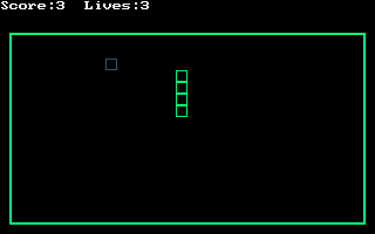

# Snake-Assembly
A simple Assembly version of the game Snake. 

An old student project created together with Pieter Mensalt. Easiest way to run is by using DosBox (http://www.dosbox.com/).

# Screenshot

